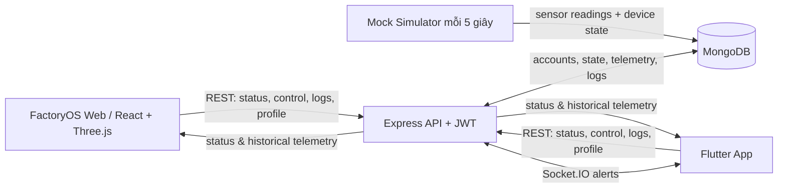

# Smart Factory IoT — FactoryOS

Ứng dụng giám sát và điều khiển nhà máy thông minh gồm ứng dụng Flutter, web digital twin 3D và API Node.js lưu dữ liệu trong MongoDB. Cả hai giao diện dùng chung backend, tài khoản và trạng thái của 16 thiết bị.

## Thành phần

| Thư mục | Vai trò | Công nghệ |
|---|---|---|
| `backend/` | API, xác thực JWT, MongoDB, mô phỏng telemetry, logs | Node.js 20+, TypeScript, Express, Mongoose, Socket.IO |
| `factory-web/` | Web control room, các tab Dashboard/Devices/Analytics/Profile và digital twin 3D | React, TypeScript, Vite, Three.js, React Three Fiber |
| `flutter-iot/` | Ứng dụng Flutter đa nền tảng | Flutter, Dart, Provider |

## Workflow hệ thống



### Luồng đăng nhập và dữ liệu

1. Người dùng đăng ký hoặc đăng nhập bằng email/mật khẩu qua `/auth/register` hoặc `/auth/login`.
2. Backend lưu mật khẩu dạng bcrypt hash và trả JWT. Web lưu token trong `localStorage`; Flutter lưu token trong secure storage.
3. Frontend gửi JWT trong header `Authorization: Bearer <token>` khi gọi API cần xác thực.
4. Backend giới hạn dữ liệu theo tài khoản: mỗi user chỉ đọc và thay đổi trạng thái thiết bị, lịch sử và logs của chính mình.
5. Với tài khoản demo được cấu hình, simulator tạo/cập nhật 4 cảm biến và 16 thiết bị mỗi 5 giây, lưu snapshot mới nhất vào `DeviceState`, lịch sử vào `Telemetry`, cảnh báo vào `AlertLog`.
6. Thao tác bật/tắt/chỉnh sửa thiết bị từ web hoặc Flutter cập nhật cùng trạng thái MongoDB. Analytics đọc telemetry/logs đã lưu; digital twin phản ánh trạng thái trong `devices_control`.

### Inventory hiện tại

- Cảm biến: nhiệt độ, áp suất, ánh sáng, độ ẩm.
- Thiết bị: 2 robot arm, 2 AVG robot, 2 băng tải, 4 đèn LED, 2 quạt, 2 camera, 2 máy Auto.

## Yêu cầu

- Node.js 20 trở lên và npm.
- MongoDB local hoặc MongoDB Atlas.
- Flutter SDK/Dart nếu chạy ứng dụng Flutter.
- Một trình duyệt hiện đại cho web.

## Chạy lần đầu

### 1. Cấu hình backend

Mở terminal tại `backend/`, tạo file `.env` dựa theo `.env.example`, sau đó điền thông tin MongoDB và secrets riêng của bạn. Không commit `.env` hoặc chia sẻ giá trị `JWT_SECRET`, mật khẩu, token, hay URI có credentials.

Các biến cần thiết:

| Biến | Ý nghĩa |
|---|---|
| `PORT` | Cổng API; mặc định `3000` |
| `MONGODB_URI` | URI kết nối MongoDB |
| `JWT_SECRET` | Secret ký JWT, tối thiểu 32 ký tự ngẫu nhiên |
| `DEMO_USER_EMAIL` | Email tài khoản nhận dataset mô phỏng |
| `DEMO_USER_PASSWORD` | Mật khẩu seed demo, tối thiểu 12 ký tự |
| `CORS_ORIGINS` | Các origin frontend được phép; khi phát triển, backend cho phép localhost |

Cài dependency, tạo/cập nhật user demo và dữ liệu mẫu, rồi chạy API:

```powershell
cd backend
npm install
npm run seed
npm run dev
```

Giữ terminal backend mở. Kiểm tra API tại `http://localhost:3000/health`; khi thành công, `ok` là `true` và `database` là `connected`.

> Chạy `npm run seed` sẽ tạo/cập nhật snapshot thiết bị demo và tạo telemetry mẫu, đồng thời thay logs của tài khoản demo. Chỉ seed lại khi muốn khởi tạo lại dữ liệu mẫu.

### 2. Chạy web FactoryOS

Mở terminal thứ hai:

```powershell
cd factory-web
npm install
npm run dev
```

Mặc định Vite dùng `http://localhost:5173`. Web gọi API tại `http://localhost:3000`. Nếu dùng địa chỉ API khác, đặt `VITE_API_URL` trong file `.env.local` tại `factory-web/`, ví dụ `VITE_API_URL=http://localhost:3000`.

Đăng nhập bằng `DEMO_USER_EMAIL` và `DEMO_USER_PASSWORD` đã cấu hình ở backend. Nếu cổng 5173 đang bận, đổi cổng bằng `npm run dev -- --port 5175` rồi mở URL Vite in ra terminal.

### 3. Chạy ứng dụng Flutter

Mở terminal thứ ba:

```powershell
cd flutter-iot
flutter pub get
flutter run
```

- Flutter Web trên cùng máy thường dùng `http://localhost:3000`.
- Flutter hiện mặc định dùng `http://192.168.1.5:3000` trên mobile; Android emulator thường truy cập máy host qua `http://10.0.2.2:3000`.
- Điện thoại thật cần cùng mạng LAN với máy chạy backend; nhập IP LAN của máy backend trong phần cấu hình server của app (cổng `3000`).

Flutter đọc IP server đã lưu trong cấu hình ứng dụng nếu có; nếu chưa đặt, app dùng mặc định nêu trên. Để chạy Android emulator, đặt IP server là `10.0.2.2`; với điện thoại thật, đặt IP LAN của máy backend. File `flutter-iot/.env.example` là mẫu cấu hình tham khảo, còn host mặc định hiện nằm trong `AuthService`/`IotProvider`.

## Các tab trên web

- **Tổng quan:** số liệu thiết bị, cảm biến hiện tại, digital twin nhà máy 3D và sự kiện gần đây.
- **Thiết bị:** tìm thiết bị, xem mô hình mô phỏng 3D, trạng thái, telemetry, bật/tắt, chỉnh tên/công suất/runtime và gửi thao tác bảo trì.
- **Phân tích:** đồ thị lịch sử telemetry được lưu ở backend và timeline alert/event.
- **Hồ sơ:** xem/cập nhật thông tin người dùng.

## API chính

Các route IoT yêu cầu JWT; route được giới hạn theo tài khoản đăng nhập.

| Method | Route | Mục đích |
|---|---|---|
| `GET` | `/health` | Kiểm tra API và MongoDB |
| `POST` | `/auth/register` | Tạo tài khoản |
| `POST` | `/auth/login` | Đăng nhập, nhận JWT |
| `GET`, `PATCH` | `/auth/me` | Đọc/cập nhật hồ sơ |
| `GET` | `/iot/status` | Snapshot cảm biến và thiết bị mới nhất |
| `GET` | `/iot/telemetry?limit=120` | Lịch sử telemetry |
| `GET` | `/iot/logs` | Nhật ký cảnh báo/sự kiện |
| `POST` | `/iot/control` | Bật/tắt thiết bị |
| `PATCH` | `/iot/devices/:deviceId` | Cập nhật cấu hình thiết bị |
| `POST` | `/iot/devices/:deviceId/reset-health` | Thao tác bảo trì/reset runtime |

## Kiểm tra và build

Backend:

```powershell
cd backend
npm test
npm run build
```

Web:

```powershell
cd factory-web
npm run build
```

Flutter:

```powershell
cd flutter-iot
flutter analyze
flutter test
```

## Khắc phục nhanh

- **Web hiện 0 thiết bị:** đảm bảo backend đang chạy, tài khoản demo đã seed và đăng nhập bằng đúng tài khoản `DEMO_USER_EMAIL`.
- **API báo database disconnected / startup thất bại:** kiểm tra `MONGODB_URI`, kết nối MongoDB và log của backend.
- **Port 3000 đang được dùng:** không khởi động thêm backend thứ hai; kiểm tra tiến trình hiện có. Nếu chủ động đổi `PORT`, đồng thời cập nhật `VITE_API_URL` và API host của Flutter.
- **Flutter trên điện thoại không kết nối:** không dùng `localhost`; sử dụng IP LAN của máy đang chạy backend và cho phép kết nối qua firewall.
- **CORS:** thêm origin web đang dùng vào `CORS_ORIGINS` trong `backend/.env`, khởi động lại API.
- **Analytics không có nhiều điểm:** simulator chỉ ghi dữ liệu khi backend chạy và chỉ gán tự động cho tài khoản demo cấu hình trong `DEMO_USER_EMAIL`.

## Bảo mật và dữ liệu

- Không commit `.env`, `.env.local`, credentials MongoDB, JWT secret hoặc token.
- `.env.example` chỉ chứa placeholder; thay bằng secret mạnh ở máy chạy ứng dụng.
- Dataset mô phỏng được gán tự động cho tài khoản email trong `DEMO_USER_EMAIL`; tài khoản đăng ký khác có thể chưa có `DeviceState` demo.
- Đây là môi trường mô phỏng phần cứng; dữ liệu công suất/telemetry không đại diện cho thiết bị sản xuất thật.
